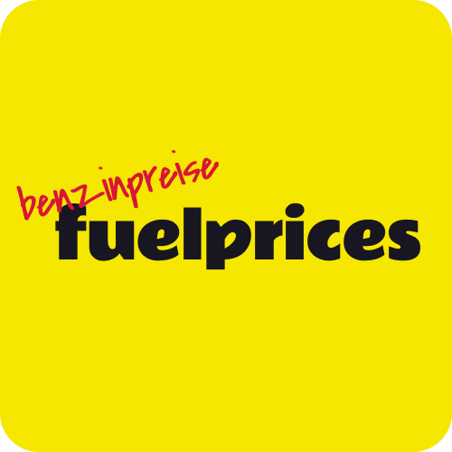

   

  
  
  
  
  

## Description

My Fuelprices application consists of a Python webscraper that reads the current fuel prices of the Avanti and Jet gas stations in St. Pölten every hour and stores them in a PostgreSQL database.

The [backend](https://github.com/simonmader17/fuelprices-api) is a Java Spring RESTful web service and the frontend I implemented with Svelte.

Additionally, I wrote a [Telegram bot](https://github.com/simonmader17/fuelprices-bot) that you can ask for the latest prices and it will notify you of new weekly/monthly lows.

